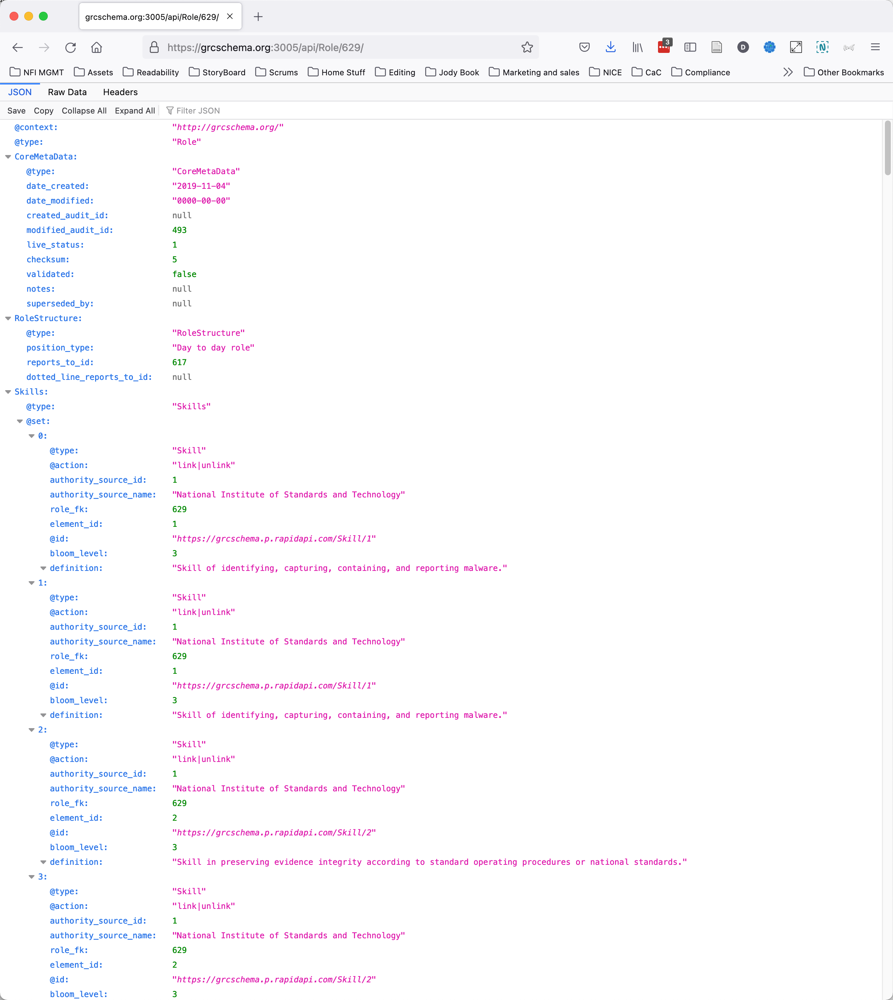
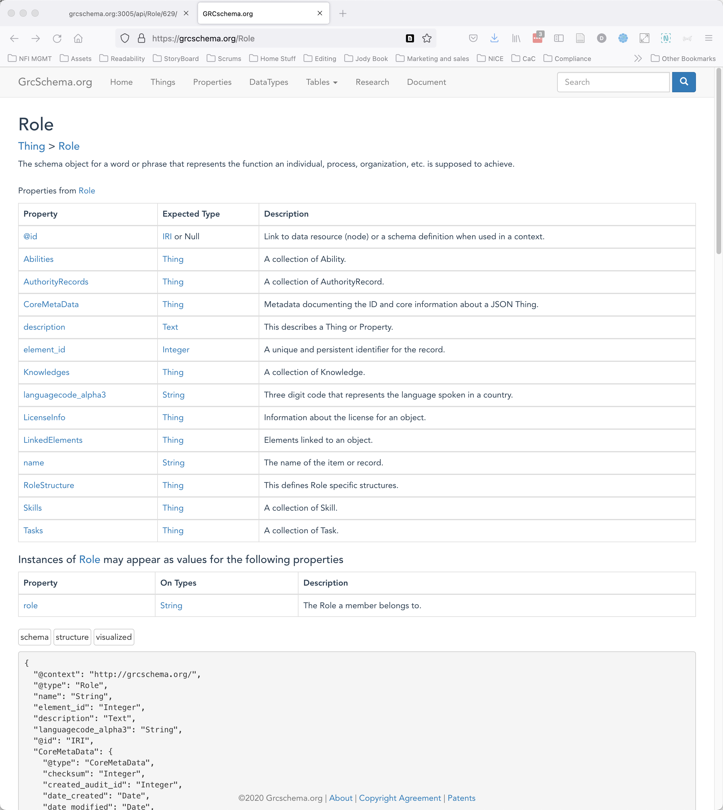
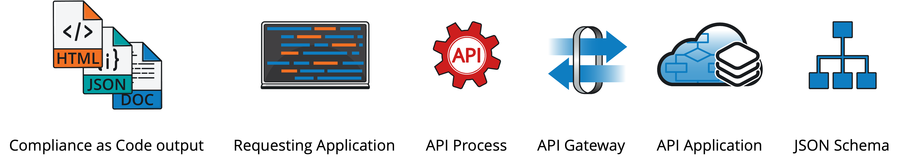
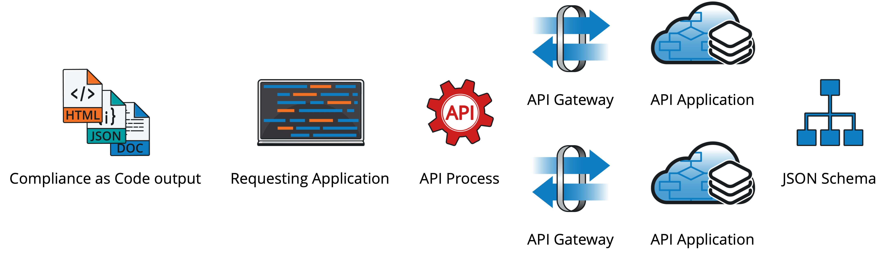

# A quick visual explanation of Compliance as Code

In the opening, we said that Compliance as Code gives us the structures to read, interpret, and output compliance requirements in human-readable and machine-readable formats simultaneously. But what does that _really mean_ for us as end-users, integrators, and developers? Let’s go through a simple “explanation as visualization.” Below is a diagram of a Role Description that anyone’s organization might have. It’s shown visually here as an HTML file.

Notice the URL for this document: [https://grcschema.org:3005/api/Role/629/**render**](https://grcschema.org:3005/api/Role/629/render). We bolded the last word for emphasis. This document was created – on the fly – using an API call. What’s embedded in this document is what is important.

By merely taking off the **render** portion of the API call \([https://grcschema.org:3005/api/Role/629/](https://grcschema.org:3005/api/Role/629/)\), the page now displays as native JSON-LD. With the flip of a switch, the _human-readable_ document is stripped away to reveal the _machine-readable_ document that created it.

And that machine-readable document can be traced back to the JSON-LD schema that defines it, shown below \(courtesy of grcschema.org\), which can be found at [https://grcschema.org/Role](https://grcschema.org/Role).

A simple process lives between the **output** \(JSON-LD embedded into HTML, OpenDoc, or PDF\) and the JSON-LD **schema**, as shown in the diagram below.

From left to right, **output** \(JSON, HTML, OpenDoc, PDF, etc.\) is generated by a **requesting application**. That application gets the data through a standardized **API** **process** that hits an **API** **gateway** to draw data from an **API application**. Of course, the **API application** formats the data according to the **JSON** **schema**.

Why is this important? One of the _freeing_ things is that the Compliance as Code flow allows an application to draw API data from _multiple_ gateways simultaneously, as shown in the following diagram.

For instance, the Roles Description document we used above draws information from _all_ the following API sources:

* UCF’s Roles API for multiple parts
* onetcenter.org for Occupational Listings
* OpenSkillsNetwork.org for Skill listings
* Badgr.org for Qualification Badges

In this example, Compliance as Code allows for open, shared definitions of occupations, skills, knowledge, and even shared skill badges.

Overall, Compliance as Code allows both interoperability and machine-actionable content to be created as well as consumed.

