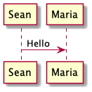
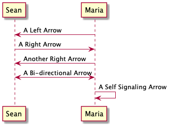
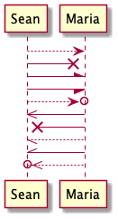
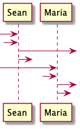
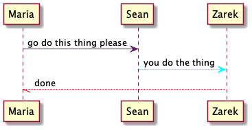

# Connectors and Terminators

### Sequence Arrows

The basic connector and terminator between participants in a sequence diagram is an arrow. The sequence has an optional label. The label is created by placing a colon after the second participant followed by the content of the label.

```
@startuml

'declare participants
participant Sean 
participant Maria

'make a sequence from Sean to Maria called "Hello"
Sean -> Maria : Hello

@enduml
```



### Sequence Direction

The direction of the arrow can point left, be bi-directional, or self signaling. This will work with all arrow types. Notice the arrow on line 10. It is right facing in the code but still properly points left from Maria to Sean in the sequence diagram.

```
@startuml

'Declare participants
participant Sean 
participant Maria

'Multiple arrow directions
Sean <- Maria : A Left Arrow
Sean -> Maria : A Right Arrow
Maria -> Sean : Another Right Arrow
Sean <-> Maria : A Bi-directional Arrow
Maria -> Maria : A Self Signaling Arrow

@enduml
```



### Sequence Terminators

There are multiple terminators for arrows seen below. Notice that using two greater than signs or two slash marks makes the arrow in the sequence diagram thinner. Multiple dashes make the arrow dotted.

```
@startuml

'Declare participants
participant Sean 
participant Maria

'Arrow terminator types
Sean -->Maria
Sean ->x Maria
Sean -\ Maria
Sean -/ Maria
Sean -->o Maria
Sean <<- Maria
Sean x<<- Maria
Sean \\-- Maria
Sean //- Maria
Sean o<<-- Maria

@enduml
```



### Incoming and Outgoing Messages

Arrows can represent incoming and outgoing messages by using square brackets or a question mark in place of a participant. Square bracket messages will reach the exterior edge of the diagram and question mark messages will be shorter.

```
@startuml

'Declare participants
participant Sean 
participant Maria

'Incoming and outgoing messages
[-> Sean
?-> Sean
Sean ->] 
Sean ->?
[-> Maria
?-> Maria
Maria ->] 
Maria ->?

@enduml
```



### Time Duration and Anchors

Anchors allow the ability to specify time duration in a sequence diagram. This is activated with the teoz command and signaled with start and end anchors. Multiple durations can be specified but are not required. As of this writing, the teoz duration arrow does not support dotted lines, other terminators, or color changes.

```
@startuml

'Declare participants
participant Maria
participant Sean
participant Zarek

'This line is required for the anchors to work
!pragma teoz true

'Anchors are placed at the beginning of chosen lines
{start1} Maria -> Sean : go do this thing please
{start2} Sean -> Zarek : you do the thing
{end2}   Zarek -> Sean : done
{end1}   Sean -> Maria : finished

'These lines draw the time duration connectors
{start1} <-> {end1} : duration
{start2} <-> {end2} : shorter duration

@enduml
```


### Connector Colors

Sequence arrows and their endpoints can be colored. This is done by adding a standard color name or hex code inside of square brackets to the arrow in the code. The placement of the color is flexible. For the sake of consistency, we will be placing the color inside of the arrow next to the arrowhead. As of this writing, there is no process for changing the color of the teoz time duration connector.

```
@startuml

'Declare participants
participant Maria
participant Sean
participant Zarek

'Colored arrow examples
 Maria -[#561D5E]> Sean : go do this thing please
 Sean --[#cyan]> Zarek : you do the thing
 Maria \\[#FF0000]-- Zarek : done

@enduml
```


