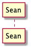
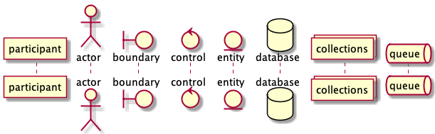
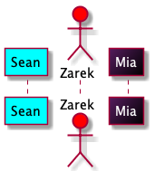
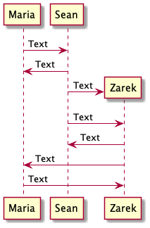
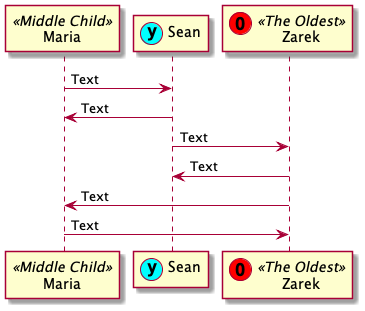

# Icons

### Participant Declaration

The icons in a sequence diagram are called participants. These can be declared by simply typing "participant" followed by the name of the participant.

```
@startuml

'declare the participant then names it "Sean"
participant Sean

@enduml
```



### Participant Types

There are eight participant types.

* participant
* actor
* boundary
* control
* entity
* database
* collections
* queue

```
@startuml

participant participant
actor       actor
boundary    boundary
control     control
entity      entity
database    database
collections collections
queue       queue

@enduml
```



### Participant Colors

Participants can be given specific colors by adding a standard color name or hex code to the end of the participant declaration. Participants can be filled with gradients if two colors are used. The participant text can also be changed by using the "as" command. Notice on line seven that these colors can be used on any of the participant icons.

```
@startuml

'This makes Sean's background color cyan.
participant Sean #Cyan

'This makes Zarek's background red.
actor Zarek #FF0000

'The portion in quotes changes Maria's text color and changes the internal text. 
'The hex codes make a purple to black gradient in her background.
participant Maria as "<color:#White>Mia" #561D5E/000000

@enduml
```



### Participant Text

Participant text can be declared in a text string inside of quotation marks. It can be separated into multiple lines by using a line break and even altered with creole formatting. As of the time of this writing monospace is not supported for participant text.

```
@startuml

'Example of a string as a name.
participant "Sean The New Guy" 

'Example of bold text using creole.
participant "Maria **The Closer**"

'Example of multiline text for a participant
participant "Zarek \nThe Guy With \nCurly Hair"

'All available creole options.
participant  "**Bold** \n//Italics// \n__underline__ \n--strikethrough-- \n~~waved~~"

@enduml
```


### Participants Creating Participants

Participants can create other participants not just communicate with them. This is done by using the create command before a sequence line. Sequences are more thoroughly covered in the Connectors and Terminators section.

```
@startuml

'Declare participants
participant Maria
participant Sean

Maria -> Sean : Text
Maria <- Sean : Text

'This sets up the next sequence line to be a creator
create Zarek

'This line shows Sean creating Zarek
Sean -> Zarek : Text

'This line shows communication from Sean to Zarek
Sean -> Zarek : Text

Sean <- Zarek : Text
Zarek -> Maria : Text
Zarek <- Maria : Text

@enduml
```



### Participant Stereotypes and Spots

A stereotype can be added to a participant. Spots are added inside the stereotype with parentheses. Spots can be colored by adding hex code. Standard color names are not supported for spots.

```
@startuml

'Declare participants
'This participant has a stereotype
participant Maria << Middle Child >>

'This participant has a cyan colored spot with a lower case Y in it
participant Sean << (y,#00FFFF) >>

'This participant has a red colored spot with a capital letter O in it
'They also have a stereotype
participant Zarek << (O,#FF0000) The Oldest >>

Maria -> Sean : Text
Maria <- Sean : Text

Sean -> Zarek : Text
Sean <- Zarek : Text

Zarek -> Maria : Text
Zarek <- Maria : Text

@enduml
```


