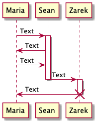
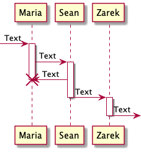
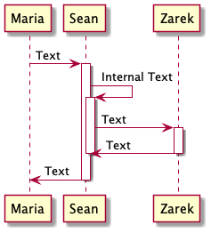
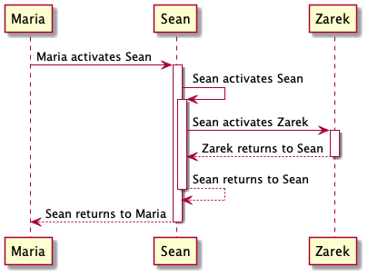
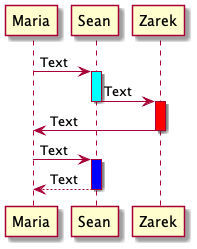

# Lifeline Activation

### Activation and Destruction

Lifelines activate and deactivate participants. Participants are activated with the "activate" command. Their life lines are concluded with the "deactivate" and "destroy" commands.

```
@startuml

'Declare participants
participant Maria
participant Sean
participant Zarek

Maria -> Sean : Text

'This will start Sean's lifeline at the above sequence
activate Sean

Maria <- Sean : Text
Maria -> Sean : Text

Sean -> Zarek : Text

'This will deactivate Sean's lifeline at the above sequence
deactivate Sean

'This will activate Zarek's lifeline at the above sequence
activate Zarek

Zarek -> Maria : Text

'This will destroy Zarek's lifeline at the above sequence
destroy Zarek

@enduml
```



#### Shortcut

The below short cuts exist for lifeline activation and deactivation. This allows for mixing activation and deactivation on the same line. Compare the previous lines 16-22 to lines 17-18 below. At the time of this writing there is no short cut for destroying a source as is done in the above line 27.

* \++ Activate Target
* \--  Deactivate source
* !!   Destroy Target

```
@startuml

'Declare participants
participant Maria
participant Sean
participant Zarek

'This incoming message activates Maria's Timeline
[-> Maria ++ : Text

'This activates Sean's lifeline
Maria -> Sean ++ : Text

'This destroys Maria's lifeline
Maria <- Sean !! : Text

'This deactivates Sean's lifeline and activates Zarek's
Sean -> Zarek --++ : Text

'This outgoing message deactivtes Zarek's timeline
Zarek ->]  -- : Text

@enduml
```



### Nesting

Lifelines can be nested with multiple activations of the same participant.

```
@startuml

'Declare participants
participant Maria
participant Sean
participant Zarek

Maria -> Sean : Text

'This activates Sean's primary lifeline
activate Sean

Sean -> Sean : Internal Text

'This activates his secondary internal lifeline
activate Sean

Sean -> Zarek : Text
activate Zarek

Zarek -> Sean : Text
deactivate Zarek

'This  deactivate Sean's secondary lifeline
deactivate Sean

Sean -> Maria : Text

'This deactivates Sean's primary lifeline
deactivate Sean

@enduml
```



### Auto-Activation

Lifelines can be automatically generated by setting autoactivate to true. In order too properly deactivate auto-activated lifelines the return command must be used. The return command deactivates the most recent lifeline that is still active and points to its activator.

```
@startuml

'Declare participants
participant Maria
participant Sean
participant Zarek

'This activates automatic lifeline generation
autoactivate on

'This will activate Sean's primary lifeline
'The activator is Maria
Maria -> Sean : Maria activates Sean

'This will activate Sean's secondary lifeline
'The activator is Sean's primary lifleine
Sean -> Sean : Sean activates Sean

'This will activate Zarek's primary lifeline
'The activator is Sean's secondary lifeline
Sean -> Zarek : Sean activates Zarek


'This deactivates Zarek's primary lifeline
'And points back to its activator, Sean's secondary lifeline 
return Zarek returns to Sean

'This deactivates Sean's secondary lifeline
'And points back to its activator, Sean's primary lifeline
return Sean returns to Sean

'This deactivates Sean's primary lifeline
'And points back to it's activator Maria
return Sean returns to Maria

@enduml
```



### Colors

Lifelines can be given colors by adding a standard color name or hex code to the end of the activate line. In the case of auto-activation the color property is placed to the left of the colon on the sequence line. Note colors can be used with shortcuts as well.

```
@startuml

'Declare participants
participant Maria
participant Sean
participant Zarek

'This will activate a lifeline for Sean that is cyan
Maria -> Sean ++ #cyan: Text

Sean -> Zarek : Text
deactivate Sean

'This will activate a lifeline for Zarek that is red
activate Zarek #FF0000

Zarek -> Maria : Text
deactivate Zarek

autoactivate on

'This begins a lifeline for sean that is blue
Maria -> Sean #0000FF :Text
return Text

@enduml
```



