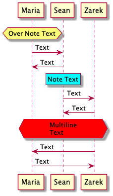

# Notes And References

### Notes For Sequence Arrows

Notes written below a sequence arrow will appear next to that arrow on the diagram. Notes can be positioned left or right of their sequence arrow. You must choose left or right. There is no default position. Multiline notes can be created by using the "end note" command. Notice that blank lines are recorded in the multiline note. Multiline notes can also be created with "\n" line breaks.

```
@startuml

'Declare participants
participant Maria
participant Sean
participant Zarek

Maria -> Sean : Text
Maria <- Sean : Text

'This note will appear to the right of the above arrow
note right: Note Text

Sean -> Zarek : Text
Sean <- Zarek : Text

'This note will appear to the right of the above arrow
'And contain two lines
note right: Multiline\nNote\nText

Zarek -> Maria : Text
Zarek <- Maria : Text

'This note will appear to the left of the above arrow
'And contain several lines
note left
Multiline
Note

Text

'This closes the multiline note
end note

@enduml
```


### Notes For Participants

Notes can be positioned to the left or right of a participant. They can also be positioned over one or more participants by adding a second name or the word "across." They will appear in the same vertical order as the sequence arrows instead of beside them. Just like notes for sequence arrows, multiline notes can be created by using the "end note" command. Again, blank lines are recorded in the multiline note.

```
@startuml

'Declare participants
participant Maria
participant Sean
participant Zarek

'This note will appear over Maria
note over Maria: Over Note Text

Maria -> Sean : Text
Maria <- Sean : Text

'This note will appear left of Maria
note left of Maria: Left Note Text

Sean -> Zarek : Text
Sean <- Zarek : Text

'This note will appear over Maria and Sean
'And contain several lines
note over Maria, Sean
Multiline
Over Note

Text

'This closes the multiline note
end note

Zarek -> Maria : Text

'This note will appear over all participants
note across: Across Note Text

Zarek <- Maria : Text

'This note will appear Right of Zarek
note Right of Zarek: Right Note Text

@enduml
```


### Note Shape And Color

Note shape is adjusted by placing an "h" or "r" at the front of the "note" command. Color is adjusted by placing a standard color name or hex code immediately after the positioning commands.

```
@startuml

'Declare participants
participant Maria
participant Sean
participant Zarek

'This is a hexagon shaped note defined by "hnote"
hnote over Maria: Over Note Text

Maria -> Sean : Text
Maria <- Sean : Text

'This is a rectangle shaped note define by "rnote"
'It also has a cyan backgroun
rnote over Sean #cyan: Note Text

Sean -> Zarek : Text
Sean <- Zarek : Text

'This is a red, hexagon, multiline note
hnote across #FF0000
Multiline
Text
end hnote

Zarek -> Maria : Text
Zarek <- Maria : Text

@enduml
```



###
