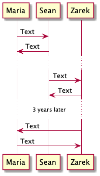

# Organization

### Participant Order

Participants can be placed in a specific order with the "order" command regardless of the order in which they are declared.

```
@startuml

'Declare participants
participant "Maria the middle child" order 2
participant "Sean the youngest" order 3
participant "Zarek the oldest" order 1

@enduml
```


### Sequence Auto-numbering

Sequences can be automatically numbered with the "autonumber" command. They start at number one as a default but can be given a different starting value. \***can these values be negative?**\* They can also be given an increment value.

```
@startuml

'The command to start the auto-numbering sequence
autonumber

'Declare participants
participant Maria
participant Sean
participant Zarek

'With no further parameters, these will be messages 1 and 2
Maria -> Sean : Text
Maria <- Sean : Text

'This command starts the auto number sequence and gives a starting value of 10
autonumber 10

'These two sequences will be numbered 10 and 11
Sean -> Zarek : Text
Sean <- Zarek : Text

'This command starts the auto number sequence at 20 
'And tells the program to go up by increments of 5
autonumber 20 5

'These two sequences will be numbered 20 and 25
Zarek -> Maria : Text
Zarek <- Maria : Text

@enduml
```


### Stopping and Resuming Auto-numbers

Autonumbering can be turned off and on using the keywords "stop" and "resume."

```
@startuml

'Declare participants
participant Maria
participant Sean
participant Zarek

'The sequences following this line will be auto-numbered
autonumber

Maria -> Sean : Text
Maria <- Sean : Text

'The sequences following this will not be auto-numbered
autonumber stop

Sean -> Zarek : Text
Sean <- Zarek : Text

'The sequences following this will resume the previous count
'Then increase by an increment of 10
autonumber resume 10

Zarek -> Maria : Text
Zarek <- Maria : Text

@enduml
```


### Formatting Auto-numbers

Double quotes allow formatting options for auto-numbers. Parentheses, brackets, and leading words can be added to auto-numbers. Default number format can be adjusted with zeroes and hash marks similar to Java's decimal format. Color and emphasis are similar to formatting in HTML.

```
@startuml

'Declare participants
participant Maria
participant Sean
participant Zarek

'The auto numbers following this line will be bold, 
'wrapped in square brackets, and have three digits regardless of value.
autonumber "<b>[000]</b>"

Maria -> Sean : Text
Maria <- Sean : Text

'The auto numbers following this line will be underlined,
'wrapped in parentheses, and will have no extra zeroes as place holders.
autonumber 10 "(<u>#</u>)"

Sean -> Zarek : Text
Sean <- Zarek : Text

'The auto numbers following this line will be italicized,
'red and lead by "Leading Words"
autonumber 20 5 "<font color=red><i>Leading Words #</i></font>"

'These two sequences will be numbered 20 and 25
Zarek -> Maria : Text
Zarek <- Maria : Text

@enduml
```


### Multiple Pages

Diagrams can be split into multiple pages using the "newpage" command.

```
@startuml

'Declare participants
participant Maria
participant Sean
participant Zarek

Maria -> Sean : Text
Maria <- Sean : Text
Sean -> Zarek : Text

'This causes a break in pages when images are generated.
newpage

Sean <- Zarek : Text
Zarek -> Maria : Text
Zarek <- Maria : Text

@enduml
```

 

### Grouping Sequences

There are seven methods for grouping in the sequence diagram. The "else" command can be used as a divider inside of all group types. All of the group types are closed with the "end" command. The first six types use the exact same syntax, are atuomatically labeled, and have an optional header. The "group" command has the option of changing the label as well as the optional header.

* alt
* opt
* loop
* par
* break
* critical
* group

```
@startuml

'Declare participants
participant Maria
participant Sean
participant Zarek

Maria -> Sean : Text

'The alt command begins a group with the "alt" label
'This can be replaced with any of the other group types
alt Optional Header

Maria <- Sean : Text

'The else command is used as a divider
'It also has an optional Header
else Also an Optional Header

Sean -> Zarek : Text
Sean <- Zarek : Text

'You can use multiple else commands
else

    'This begins a group with a label of "Pancake"
    'And a header of "Syrup"
    group Pancake [Syrup]

    Zarek -> Maria : Text
    Zarek <- Maria : Text
    
    'This closes the group labeled "Pancake"
    end

'This closes the initial alt group
end

@enduml
```


### Boxes

Participants can be encompassed inside of a box. The box has an optional title.

```
@startuml

'Declare participants

'This begins a box around Maria and Sean
box
participant Maria
participant Sean

'This ends the box around Maria and Sean
end box

'This box has a title
box Besties
participant Zarek
participant Ivy
end box

Maria -> Sean : Text
Maria <- Sean : Text

Sean -> Zarek : Text
Sean <- Zarek : Text

Zarek -> Ivy : Text
Zarek <- Ivy : Text

Zarek -> Maria : Text
Zarek <- Maria : Text

@enduml
```


### Box Colors

Box backgrounds can be given specific colors by adding a standard color name or hex codes. Gradients can be achieved with two colors. Box titles can be formatted with Creole and Markup formatting. See [Text Formatting](text-formatting.md) under Sequence Diagram. Box titles do not support bold emphasis as the default title is already bold.

```
@startuml

'Declare participants

'This box has a purple to cyan gradient
box Acquaintances #561D5E/cyan 
participant Maria
participant Sean
end box

'This box is red
box Besties #red
participant Zarek
participant Ivy
end box

Maria -> Sean : Text
Maria <- Sean : Text

Sean -> Zarek : Text
Sean <- Zarek : Text

Zarek -> Ivy : Text
Zarek <- Ivy : Text

Zarek -> Maria : Text
Zarek <- Maria : Text

@enduml
```


### Dividers

The diagram is divided by using four equal signs with an optional title in the middle.

```
@startuml

'Declare participants
participant Maria
participant Sean
participant Zarek

Maria -> Sean : Text
Maria <- Sean : Text

'This divider has no title
====

Sean -> Zarek : Text
Sean <- Zarek : Text

'This divider has a title
==Optional Title==

Zarek -> Maria : Text
Zarek <- Maria : Text
    
@enduml
```


### Spacing

You can use the pipe key to add vertical space to a sequence diagram.

```
@startuml

'Declare participants
participant Maria
participant Sean
participant Zarek

Maria -> Sean : Text

'There is no added spacing here

Maria <- Sean : Text

'This will add 50 extra pixels between the above and below sequences
||50||

Sean -> Zarek : Text

'This the short cut for adding 25 pixels
|||

Sean <- Zarek : Text

'This is smaller and almost not noticeable
||1||

Zarek -> Maria : Text
Zarek <- Maria : Text

@enduml
```


### Delays

You can use three periods to show a delay in a sequence diagram. Delays have an optional text field.&#x20;

```
@startuml

'Declare participants
participant Maria
participant Sean
participant Zarek

Maria -> Sean : Text
Maria <- Sean : Text

'There is a delay here
...

Sean -> Zarek : Text
Sean <- Zarek : Text

'This delay has text
... 3 years later ...

Zarek -> Maria : Text
Zarek <- Maria : Text

@enduml
```


