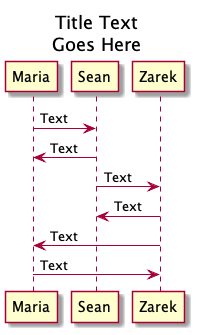
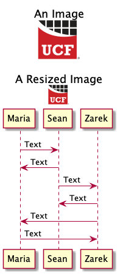
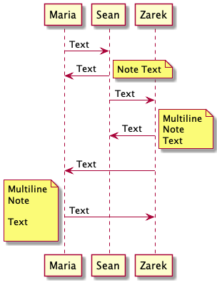
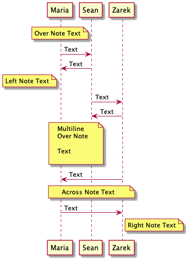
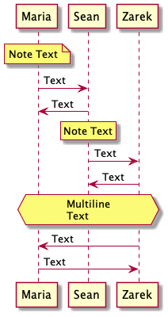
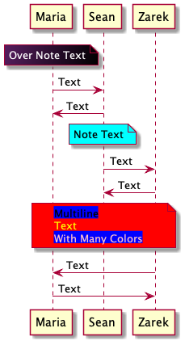
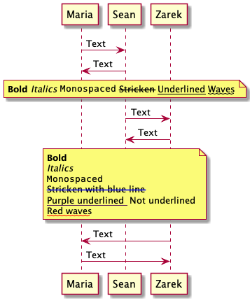
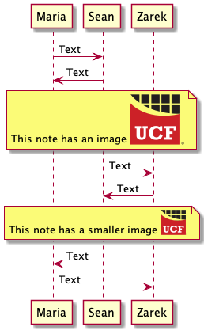
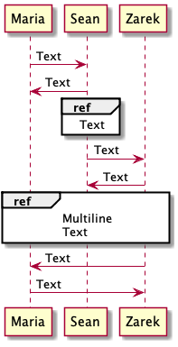

# Titles, Notes, And References

### Titles

Titles are created with the title command. They can be single line or multiline. Titles support Creole and Markup syntax for emphasis and coloring. See [Text Formatting](text-formatting.md) under Sequence Diagram.

```
@startuml

'This line creates a title the "\n" adds a line break
title Title Text\nGoes Here

'Declare participants
participant Maria
participant Sean
participant Zarek

Maria -> Sean : Text
Maria <- Sean : Text

Sean -> Zarek : Text
Sean <- Zarek : Text

Zarek -> Maria : Text
Zarek <- Maria : Text

@enduml
```



#### End Title

This multiline title uses the "end title" command.

```
@startuml

'This creates a multiline title closed with the "end title" command
title 
Title Text
Goes Here
end title

'Declare participants
participant Maria
participant Sean
participant Zarek

Maria -> Sean : Text
Maria <- Sean : Text

Sean -> Zarek : Text
Sean <- Zarek : Text

Zarek -> Maria : Text
Zarek <- Maria : Text

@enduml
```


### Images In Titles

Images can be added to titles. They can also be resized. ****&#x20;

```
@startuml

'This title has text images
title 
An Image


A Resized Image

end title

'Declare participants
participant Maria
participant Sean
participant Zarek

Maria -> Sean : Text
Maria <- Sean : Text

Sean -> Zarek : Text
Sean <- Zarek : Text

Zarek -> Maria : Text
Zarek <- Maria : Text

@enduml
```



### Notes For Sequence Arrows

Notes written below a sequence arrow will appear next to that arrow on the diagram. Notes can be positioned left or right of the sequence arrow. You must choose left or right. There is no default position. Multiline notes can be created by using the "end note" command. Notice that blank lines are recorded in the multiline note. Multiline notes can also be created with "\n" line breaks.

```
@startuml

'Declare participants
participant Maria
participant Sean
participant Zarek

Maria -> Sean : Text
Maria <- Sean : Text

'This note will appear to the right of the above arrow
note right: Note Text

Sean -> Zarek : Text
Sean <- Zarek : Text

'This note will appear to the right of the above arrow
'And contain two lines
note right: Multiline\nNote\nText

Zarek -> Maria : Text
Zarek <- Maria : Text

'This note will appear to the left of the above arrow
'And contain several lines
note left
Multiline
Note

Text

'This closes the multiline note
end note

@enduml
```



### Notes For Participants

Notes can be positioned to the left or right of a participant. They can also be positioned over one or more participants by adding a second name or the word "across." They will appear in the same vertical order as the sequence arrows instead of beside them. Just like notes for sequence arrows, multiline notes can be created by using the "end note" command. Again, blank lines are recorded in the multiline note.

```
@startuml

'Declare participants
participant Maria
participant Sean
participant Zarek

'This note will appear over Maria
note over Maria: Over Note Text

Maria -> Sean : Text
Maria <- Sean : Text

'This note will appear left of Maria
note left of Maria: Left Note Text

Sean -> Zarek : Text
Sean <- Zarek : Text

'This note will appear over Maria and Sean
'And contain several lines
note over Maria, Sean
Multiline
Over Note

Text

'This closes the multiline note
end note

Zarek -> Maria : Text

'This note will appear over all participants
note across: Across Note Text

Zarek <- Maria : Text

'This note will appear Right of Zarek
note Right of Zarek: Right Note Text

@enduml
```



### Note Shape

Note shape is adjusted by placing an "h" or "r" at the front of the "note" command.&#x20;

```
@startuml

'Declare participants
participant Maria
participant Sean
participant Zarek

'This is a standard shaped note
note over Maria: Note Text

Maria -> Sean : Text
Maria <- Sean : Text

'This is a rectangle shaped note defined by "rnote"
rnote over Sean: Note Text

Sean -> Zarek : Text
Sean <- Zarek : Text

'This is a hexagon multiline note
hnote across
Multiline
Text
end hnote

Zarek -> Maria : Text
Zarek <- Maria : Text

@enduml
```



### Note Color

The background color is adjusted by placing a standard color name or hex code immediately after the positioning commands. The font color is changed similar to HTML.&#x20;

```
@startuml

'Declare participants
participant Maria
participant Sean
participant Zarek

'This is a purple to black gradient background with white text
note over Maria #561D5E/000000: <color #FFFFFF>Over Note Text</color>

Maria -> Sean : Text
Maria <- Sean : Text

'This has a cyan background
note over Sean #cyan: Note Text

Sean -> Zarek : Text
Sean <- Zarek : Text

'This is a red red background, multiline note
'With various font colors
note across #FF0000
<back:blue>Multiline</back>
<color:yellow>Text</color>
<back:blue><color:pink>With Many Colors</color></back>
end note

Zarek -> Maria : Text
Zarek <- Maria : Text

@enduml
```



### Emphasized Note Text

Text emphasis can be added with Creole or markup syntax. Note that with the markup style the emphasis color can be changed.

```
@startuml

'Declare participants
participant Maria
participant Sean
participant Zarek

Maria -> Sean : Text
Maria <- Sean : Text

'These are emphasis options with Creole
note across: **Bold** //Italics// ""Monospaced"" --Stricken-- __Underlined__ ~~Waves~~

Sean -> Zarek : Text
Sean <- Zarek : Text

'These are emphasis options with mark up
note across
<b>Bold</b>
<i>Italics</i>
<font:monospaced>Monospaced</font>
<s:blue>Stricken with blue line</s>
<u:#561D5E>Purple underlined </u> Not underlined
<w:red>Red waves</w>
end note

Zarek -> Maria : Text
Zarek <- Maria : Text

@enduml
```



### Images In Notes

Images can be added to notes. They can also be resized. ****&#x20;

```
@startuml

'Declare participants
participant Maria
participant Sean
participant Zarek

Maria -> Sean : Text
Maria <- Sean : Text

'This note has an image
note across
This note has an image 
end note

Sean -> Zarek : Text
Sean <- Zarek : Text

'This note has a smaller image
note across: This note has a smaller image 

Zarek -> Maria : Text
Zarek <- Maria : Text

'This note has an image
'note across: This note has a smaller image 
'Need to come back and figure out how to use a local image.

@enduml
```



### References

References are added with the command "ref over." Note there is no "across" command for references. While some font emphasis and coloring options from notes will work in references, this is not the intended purpose for references.

```
@startuml

'Declare participants
participant Maria
participant Sean
participant Zarek

Maria -> Sean : Text
Maria <- Sean : Text

'This makes a reference over Sean
ref over Sean: Text

Sean -> Zarek : Text
Sean <- Zarek : Text

'This makes a multiline reference over multiple participants
ref over Maria, Zarek
Multiline
Text
end ref

Zarek -> Maria : Text
Zarek <- Maria : Text

@enduml
```


