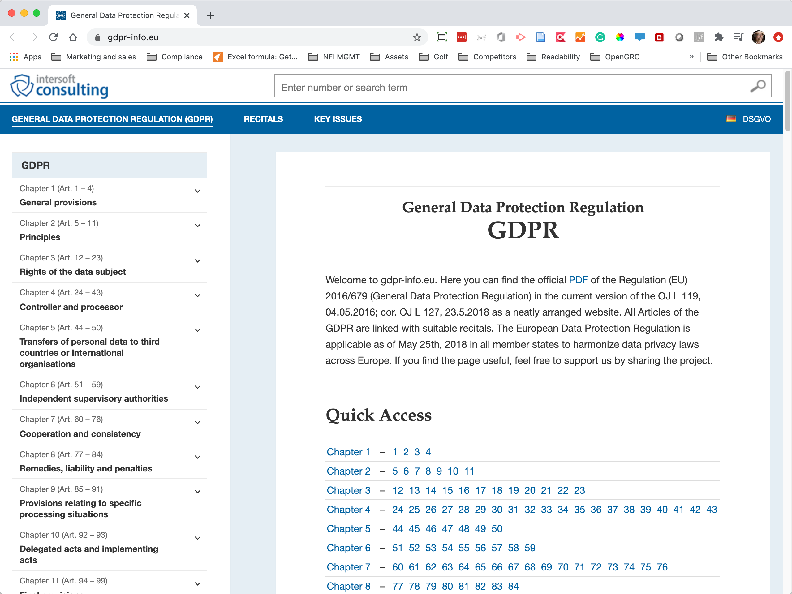
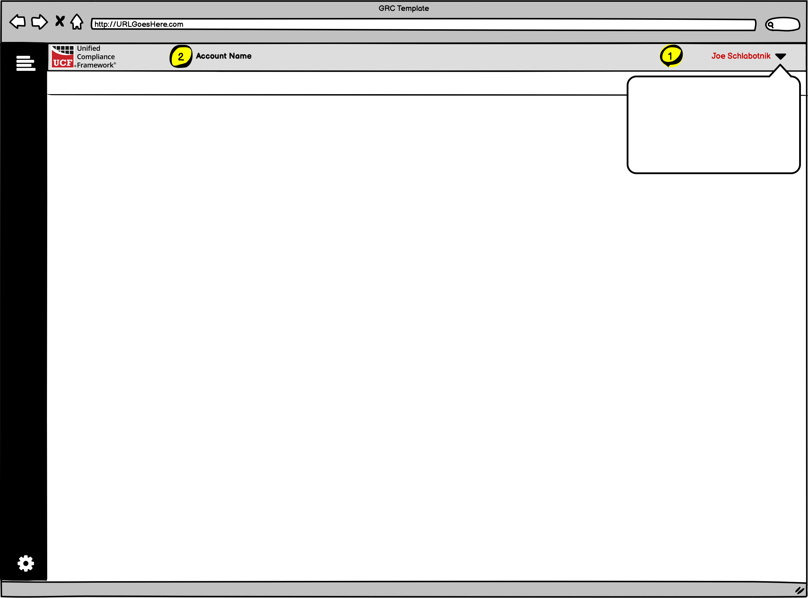

# Window Basics

In this section we will cover colors, user & account information, and navigation.

## Colors

Colors should be set as applicable styles within the wireframe, and changeable by each organization. There are three items to consider:

1. The clients should be able to upload their logo.
2. The clients should be able to have a primary brand color used for highlighting, fonts, headlines, etc.
3. A secondary color should also be chooseable for the title bar.

## User & Account information

There are two items that should be displayed – user and account information.

1.  If the window will be a sign-in window, this is where the active User’s name will go. The dropdown will show

    \-the user’s name

    \-a button to go to the user’s profile

    \-a button to sign the user out
2. The user’s associated account information should be displayed at the top of the window.

## Basic navigation

Main navigation is to the left, and secondary navigation runs across the top of the window.

1.  This is the area for the main vertical menu, if there is to be one. When the top icon is clicked it will expand to show the names of the vertical icons. Left vertical navigation has the following items associated with our various tools so far:

    \-Home

    \-Personnel

    \-Orgs & Activities

    \-Authority Documents

    \-Dictionary

    \-Citations

    \-Common Controls

    \-Assets & Config items

    \-Records

    \-Events

    \-Corpus Management

    \-cog at the bottom is settings
2. Subnavigation is found in-between the top two horizontal rules. Selected navigation will have a red underscore below it. When the left navigation is closed and a primary item is selected _that has children_, the list of the children will be displayed horizontally in the subnavigation.
3. If there is pagination, the current page is shown on the bottom left.
4. If there is pagination, the navigation for the pagination is shown on the bottom right.

## **Expanded basic navigation**

1. All names of primary menu items will be in bold. The fonts will be sized no less than 14 points for readability. When expanded, the vertical menu will show disclosure triangles for those items that have sub-menus.
2. Sub-menu items will be indented and not in bold but at the same font size. The selected items will always be in the product’s primary highlight color.
